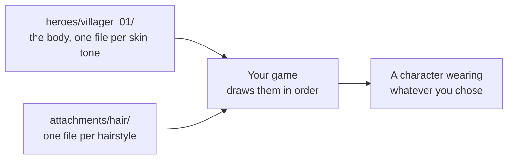

# Creating heroes, step by step

This guide walks you through making a set of characters with Pixel Forge. You will end up with a
folder your game can read, holding one sheet per character and one sheet per piece of equipment.

| | |
| --- | --- |
| **Time** | About 15 minutes |
| **You need** | A build of Pixel Forge, the three art packs, and an empty folder |
| **You do not need** | Any programming, and no knowledge of the source code |

Every number, file name, and message in this guide came from a real run. Nothing here is an
estimate.

---

## Table of contents

- [What you are building](#what-you-are-building)
- [Before you start](#before-you-start)
- [Step 1: Open the Pipeline page](#step-1-open-the-pipeline-page)
- [Step 2: Pick an output folder](#step-2-pick-an-output-folder)
- [Step 3: Name your heroes](#step-3-name-your-heroes)
- [Step 4: Choose the parts](#step-4-choose-the-parts)
- [Step 5: Pick skin tones](#step-5-pick-skin-tones)
- [Step 6: Read the count before you run](#step-6-read-the-count-before-you-run)
- [Step 7: Export](#step-7-export)
- [Checkpoint: what landed](#checkpoint-what-landed)
- [Step 8: Add a second hero](#step-8-add-a-second-hero)
- [Checkpoint: numbers stay put](#checkpoint-numbers-stay-put)
- [How a game uses these files](#how-a-game-uses-these-files)
- [Troubleshooting](#troubleshooting)
- [Where the rules are written down](#where-the-rules-are-written-down)

---

## What you are building

Pixel Forge does not bake one finished picture per outfit. It writes **layers**, and your game
stacks them at run time.

That difference matters. If you bake every outfit, then nine hairstyles, five hats, and twenty two
weapons turn into thousands of files, and a player can never change hats without a new file. If you
write layers instead, the same art is a few dozen files, and a player can swap any piece whenever
they like.



The run in this guide produced **25 sheets**: 16 for two characters across eight skin tones, and 9
for the hairstyles they can wear.

---

## Before you start

| Requirement | How to check |
| --- | --- |
| Pixel Forge is running | The window title reads **Pixel Forge** |
| The three art packs are set | Go to **Settings**. If a yellow bar appears on the Pipeline page, they are not set |
| An empty output folder | Make a new folder. Files with matching names get overwritten without asking |

Start the app with `dotnet run --project src/TheOmenDen.PixelForge`. Do not double click the built
`.exe`, because it will close right away. The reason is in
[`CLAUDE.md`](../CLAUDE.md), under **WinUI rules**.

---

## Step 1: Open the Pipeline page

Click **Pipeline** in the sidebar. This is the batch export page, and everything below happens here.


---

## Step 2: Pick an output folder

Click **Browse** next to **Output folder** and choose an empty folder.

Pick a fresh one for your first try. The app overwrites files that have the same name, and it is
easier to see what happened when nothing else is in the way.

---

## Step 3: Name your heroes

Two boxes sit under the output folder. They are new, and the first one is required.

| Box | Required? | What it does |
| --- | --- | --- |
| **Hero prefix** | Yes | Names new character folders. A prefix of `villager` gives you `villager_01`, `villager_02`, and so on |
| **Class name** | No | Names the set of equipment you ticked, such as `ranger`. Leave it empty and the app still writes the layers, it just does not name the set |

The prefix describes the **body**, not the job. Bottom, top, and head are clothing, so `villager`,
`noble`, or `guard` all make sense. The class name describes the **gear** that goes over it.

**The Export button stays off until the prefix is usable.** These are refused:

| You type | Why it is refused |
| --- | --- |
| Nothing at all | There would be no name for a new folder |
| `heroes`, `attachments`, `loadouts`, `curated` | The export folder already uses these names |
| `...` or an emoji on its own | Nothing is left after the app cleans it up |

Anything else is fine. Spaces and capitals are cleaned up for you, so `Villager Guard` becomes
`villager-guard`.

---

## Step 4: Choose the parts

Each section below the preview is one part of a character. Open a section and tick what you want.

The fastest way to get a working selection is the **Roost set (079)** button near the bottom. One
click ticks a full body and nine hairstyles, which is what this guide uses.

To pick by hand, open a section and tick files. Two tips:

- **The Filter box helps.** Long lists do not always load every row. Typing part of a name in
  **Filter** shortens the list and brings the row you want into view. Clearing the box keeps your
  ticks.
- **Bottom, top, and head go together.** Fill all three or leave all three empty. Filling only one
  or two shows a message and the count drops to zero. Leaving all three empty is allowed, and gives
  you equipment layers with no character.

### How ticking works now

This part changed, and it is the most important thing to understand.

| What you tick | What you get |
| --- | --- |
| Three bottoms, one top, one head | Three characters |
| Nine hairstyles | Nine files, no matter how many characters you have |
| Eight skin tones | Each character once per tone. Hair is not affected |

Hairstyles, hats, and weapons **do not multiply** with your characters. Each is drawn once and
shared. Only skin tones multiply, and only for the character, because hair and clothes keep the
colors they were drawn in.

---

## Step 5: Pick skin tones

Tick tones in the **Skin tones** list on the right. You get one sheet per character per tone.

This only changes parts that show skin. A hairstyle keeps its own color, which is why nine
hairstyles stay nine files no matter how many tones you pick.

---

## Step 6: Read the count before you run

The label to the left of the buttons tells you what the run will do:

```
2 characters x 8 skin tones + 9 equipment layers = 25 files
```

Read it as a sentence. If it says **Nothing to export yet**, the Export button is off and something
is missing. The usual cause is a body with only one or two of its three parts ticked.

---

## Step 7: Export

Click **Export**. The bar fills as sheets are written, and the number beside it counts up to the
total.

You can use the rest of the app while it runs. **Cancel** stops it, and sheets already written stay
on disk.

---

## Checkpoint: what landed

Open your output folder. You should see this shape:

```
heroes.json                     who each character is
heroes.csv                      the same list, for a spreadsheet
classes.csv                     what gear each class offers
index.csv                       which row holds which animation
sheets.csv                      one row per sheet
manifest.json                   the whole run, for your game to read
pixelforge-heroes-v1.json       rules for heroes.json
pixelforge-loadouts-v1.json     rules for the loadout files
pixelforge-manifest-v1.json     rules for manifest.json

heroes/
  villager_01/
    villager_01.webp            the tone the art was drawn in
    villager_01_tone-1.webp
    villager_01_tone-4-green.webp
    ... one per tone you ticked

attachments/
  hair/
    hair1.webp
    hair7.webp
    ... one per hairstyle

loadouts/
  ranger.json                   which hairstyles the ranger class offers
```

Notice three things.

**The plain `villager_01.webp` has no tone in its name.** That is the tone the artist drew, so the
app does not repeat it in the file name. Every other tone is spelled out.

**Hairstyles live in one place.** They are not copied into each character folder, because a
hairstyle looks the same on everybody.

**Your character is described in `heroes.json`:**

```json
{
  "name": "villager_01",
  "prefix": "villager",
  "number": 1,
  "body": {
    "bottom": "bottom1",
    "top": "top11",
    "head": "head1"
  },
  "assignedInRun": "019fb455-886c-7a83-b96a-7bc7c5cd27e0"
}
```

The folder name `villager_01` does not say which clothes are inside it. This file is the only place
that mapping is written down, so keep it.

**It worked.** You have a folder your game can read.

---

## Step 8: Add a second hero

Now change one part of the body and run again.

1. Open the **Bottom** section.
2. Type `bottom3` in its **Filter** box.
3. Tick `bottom3`. Leave `bottom1` ticked as well.
4. Clear the Filter box.

The count now reads:

```
2 characters x 8 skin tones + 9 equipment layers = 25 files
```

Two bottoms with the same top and head means two characters. Click **Export** again.

---

## Checkpoint: numbers stay put

Open `heroes.json` again:

```json
"heroes": [
  {
    "name": "villager_01",
    "number": 1,
    "body": { "bottom": "bottom1", "top": "top11", "head": "head1" },
    "assignedInRun": "019fb455-886c-7a83-b96a-7bc7c5cd27e0"
  },
  {
    "name": "villager_02",
    "number": 2,
    "body": { "bottom": "bottom3", "top": "top11", "head": "head1" },
    "assignedInRun": "019fb459-2e6c-716c-bcea-4065e086205c"
  }
]
```

**`villager_01` still has number 1.** It also still carries the run that first named it, which is a
different run from the one that just finished.

This is the point of the file. Once a body is given a folder name, it keeps that name forever, even
when later runs add more characters around it. If numbers moved, then a level that pointed at
`heroes/villager_02/` would quietly start showing a different character, and nothing would report an
error.

A number is never reused. Stop exporting a character and its entry stays, so its number cannot be
handed to someone else.

---

## How a game uses these files

Read `manifest.json`. Every sheet has an entry.

A character's body looks like this:

```json
{
  "name": "villager_01",
  "file": "heroes/villager_01/villager_01.webp",
  "geometry": "curated",
  "tone": "Default Tone",
  "hero": "villager_01",
  "slots": { "bottom": "bottom1", "top": "top11", "head": "head1" }
}
```

A hairstyle looks like this:

```json
{
  "name": "hair1",
  "file": "attachments/hair/hair1.webp",
  "geometry": "curated",
  "slots": { "hair": "hair1" }
}
```

The hairstyle has no `hero` and no `tone`, because it belongs to nobody in particular and its color
never changes. That absence is how your code can tell a body from a piece of equipment.

To draw a character, put the sheets on top of each other in this fixed order:

| Order | Slot | Order | Slot |
| --- | --- | --- | --- |
| 1 | shadow | 6 | head |
| 2 | backExtra | 7 | hair |
| 3 | backHair | 8 | frontExtra |
| 4 | bottom | 9 | hat |
| 5 | top | 10 | weapon |

This order never changes between animations or facing directions, so you can set it once. Each slot
draws at most one sheet.

Every sheet shares the same grid, so one set of animation timings covers all of them. `index.csv`
and `manifest.json` both carry those timings.

---

## Troubleshooting

### The Export button is greyed out

Check these in order:

1. **Is the output folder set?** It is empty when the app starts, every time.
2. **Is the hero prefix usable?** Empty, or `heroes`, `attachments`, `loadouts`, and `curated` are
   all refused.
3. **Does the count say "Nothing to export yet"?** Then nothing valid is ticked.
4. **Is a body half filled?** Bottom, top, and head go together.

### A section will not show its files

Long lists do not always load every row, and the **Hat** and **Weapon** sections are the most likely
to be affected. Type part of a file name in that section's **Filter** box. The list shortens and the
row appears.

### The message says the output folder is not there

The folder was moved or deleted after you picked it. Pick it again with **Browse**. The app will not
recreate a folder you chose, because it might write your work somewhere stale without telling you.

### The message mentions `heroes.json`

The app found a `heroes.json` it could not read, so it stopped instead of running.

This is deliberate. Renumbering on top of an existing folder would make old paths point at different
characters. Move or fix that file, then export again. If you do not need the old names, moving it
somewhere else is enough, and the next run starts again at `01`.

### Sheets from an earlier run are mentioned after a run finishes

You exported fewer files than last time, so some older sheets are still there and no longer listed
in the manifest. The app tells you which ones and leaves them alone. Delete them yourself if you do
not want them.

---

## Where the rules are written down

| Topic | Source |
| --- | --- |
| Why the export is shaped this way | [`docs/specs/001-paper-doll-layer-export.md`](specs/001-paper-doll-layer-export.md) |
| Using the rest of the app | [`README.md`](../README.md) |
| Working on the code | [`CLAUDE.md`](../CLAUDE.md) |
| What `manifest.json` may contain | `src/TheOmenDen.PixelForge.Schema/Schemas/pixelforge-manifest-v1.json` |
| What `heroes.json` may contain | `src/TheOmenDen.PixelForge.Schema/Schemas/pixelforge-heroes-v1.json` |
| What a loadout file may contain | `src/TheOmenDen.PixelForge.Schema/Schemas/pixelforge-loadouts-v1.json` |
| How the overlay draws these sheets | Corvus Connection spec 072, `docs/specs/072-ashen-rookery-avatar-overlay.md` |
| The character art | Time Fantasy by FinalBossBlues. Layer order comes from the pack's own `generator/Elements Gen 2.1/Windows/Settings.json` |

A copy of each schema ships in your output folder next to the file it describes, so you can check a
document without the app or this repository.

---

## What to do next

- Export the same characters with more skin tones and watch the equipment count stay put.
- Name a second class, tick different gear, and compare the two files in `loadouts/`.
- Read `sheets.csv` in a spreadsheet. One row per sheet, with a column per slot, so you can sort and
  filter to find any sheet you want.
